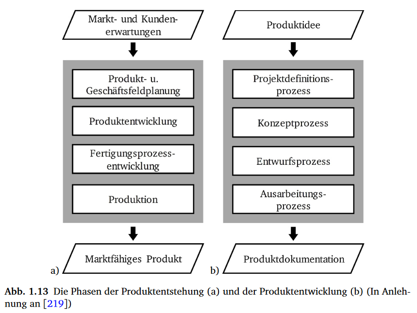
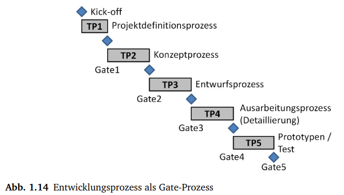

# Pomodoro-based smartphone box
Develop a phone box that works after the promodoro principe.

According to ChatGPT:
  The Pomodoro Technique is a time management method developed by Francesco Cirillo in the late 1980s. It's a simple yet effective approach to improve productivity and focus. Here's an overview of the Pomodoro Technique:

    Work in Time Blocks (Pomodoros):
        A Pomodoro is a time block, traditionally 25 minutes long.
        During a Pomodoro, you focus on a single task without any interruptions.

    Breaks:
        After each Pomodoro, take a short break of around 5 minutes.
        Longer breaks, typically 15-30 minutes, are taken after completing a set of Pomodoros (e.g., after four).

    Task Management:
        Break your work into smaller, manageable tasks.
        Choose a task to work on during each Pomodoro.

    Timer:
        Use a timer to track your Pomodoros and breaks.
        The traditional method uses a kitchen timer shaped like a tomato (hence the name "Pomodoro," which means tomato in Italian).

## Project Overview
+ The purpose of the project: to develop a Pomodoro-based smartphone box to enhance concentration. 
+ How it works: The box works on the Pomodoro principle.
  - The user sets the focus time, the break time and the number of cylce he wants to focus on an activity and closes his phone inside the box. After the defined time, the box opens automatically.
  - After a focus time, the box opens automatically
  - After a break time, the phone generates an alarm until the phone is inside the box. 

## User stories and functional requirements
+ As a user, I should not be allowed to take my phone out of the box until the time is over.
+ As a user, I want to see how much time is left.
+ As a user, I want to be able to charge my phone during concentration time.
+ As a user, I want to be able to answer a call during the focus time.
+ The system should allow the user to input the neccessary timer durations
+ The system shoud work with AA or 9 V Battery
+ The system should be cost-effective
+ The interface should be intuitive, requiring minimal instructions for operation.

# Development Process
#development-process

+ Project definition process
  - product idea
  - problem definition
  - specification and specification list
+ Project planing and definition
  - structure of the development 
  - resources
  - personnel capacities 
  - testing and production facilities 
  - time and budget
+ conception process 
  - several solution concepts at a fundamental level 
  - their characteristics
  - the most suitable concept is selected for further processing
+ Elaboration process
  - a fine-tuned definition of the components from the conception phase. 
    * the final geometry
    * surface
    * tolerance and others production specifications.
  - the creation of parts lists for material products 

The execution of each stage can be performed in a gate process, where each stage of the development process is completed by milestones or so-called **gates**. Through the gate review we check the achieved results after a stage and decide to go to the next stage (Go) or to rework the current stage (No Go).

Some characteristics of the gate process: 
* Reduction of production errors.
* The gate review allows the contribution of cross-functional disciplines.
* Enables teamwork and parallel processes 
* A common platform for all participants throughout the project
* The method used to complete a stage is flexible and, above all, cross-functional.

The folowing pictures shows how the gate process looks like: 

