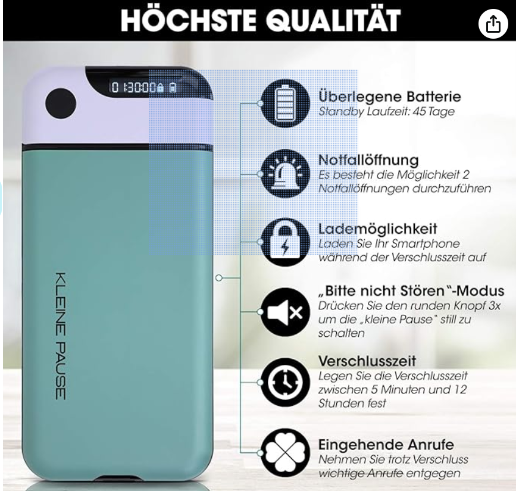
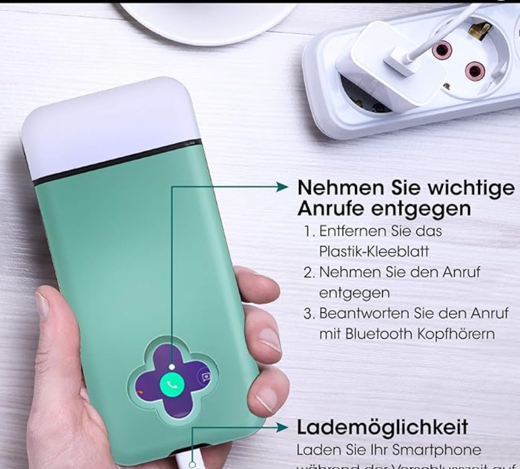
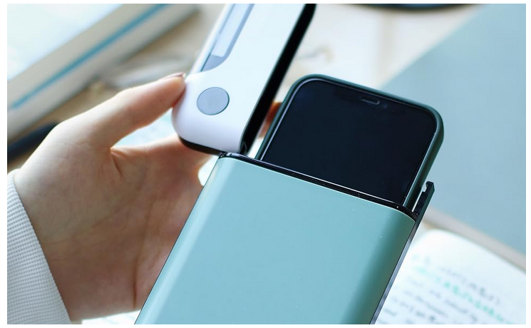
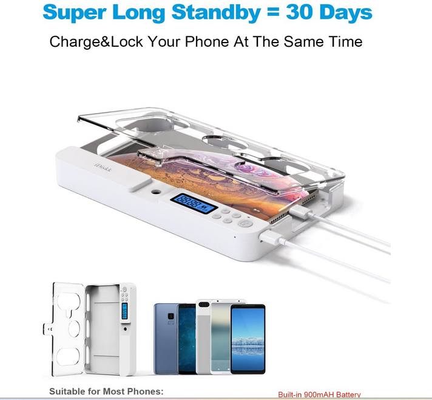
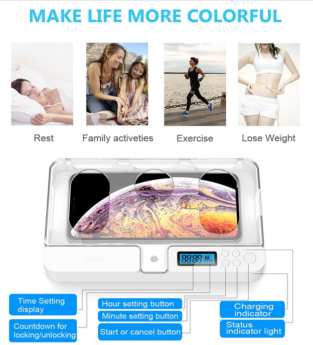

# Research phase
Link: https://blog.hubspot.com/marketing/product-development-process

According to the New Development Process, the stage after idea generation is " Research ". This stage consists of several steps such as market research or competitor analysis. In my perception, there are two goals here: 
+ Find similar products 
+ To find new ideas that can improve the idea generation.

Keywords: 
+ Synonyms for the words "Phone" 
    - Telephone
    - Mobile
    - Smartphone
+ concentration mobile box --> Results
    - [Amazon product 1](https://www.amazon.de/-/en/Smartphone-Distraction-Homework-Concentration-Compatible/dp/B08YFL328K)
    - [Amazon product 2](https://www.amazon.de/iDiskk-Schlossbox-Erwachsene-Wegsperren-Acrylnitril-Butadien-Styrol/dp/B08HZ4LYHM/ref=pd_sbs_d_sccl_3_1/261-2523103-4306608?pd_rd_w=0rVuS&content-id=amzn1.sym.6ebe1bf9-1e45-40dc-b013-9e8c7ce1588f&pf_rd_p=6ebe1bf9-1e45-40dc-b013-9e8c7ce1588f&pf_rd_r=SGYRBRTWMS7YEXY1DCAG&pd_rd_wg=jYF9K&pd_rd_r=5018a229-fb7a-440e-80c6-e06307d0d1c6&pd_rd_i=B08HZ4LYHM&psc=1)
+ Handy-Timer-Box (german) --> Mobile phone timer-box

# Amazon product 1
+ small pause (blue) cell phone timer box
+ Control over smartphone distraction during home office homework falling asleep 
+ Concentration through digital detox 
+ Phone compatibility: iPhone, Samsung, Huawei 
+ Motto: Invest your time wisely

**Features and Goals**
+ Reduce phone use
+ Targeted groups: everyone who doesn't control on it smartphone use time.
+ Locking time adjustable between 5 minutes and 12 hours.
+ Promised to be easy to use. Available in three colors
+ The emergency opening allows the phone locker to be unlocked twice during its lifetime in case of emergency. 
+ Calls can still be answered during the locking process. 
+ The phone can be charged while locked.
+ Additional materials supplied: USB charging cable + User manual + 12 months warranty
+ Battery builtin

## Amazon Product 2
iDiskk Handy Timer Box Händy Gefängnis, Universal Handy Safe Schlossbox für alle iPhones und die meisten Android Handys Geschenk für Kinder Erwachsene, Händy Wegsperren, Acrylnitril-Butadien-Styrol  --> 38,69 euro

** Features and Goals**
- for all iPhones and most Android phones such as iPhone 12 Pro Max /12/11/X/XR/XS/8 /7/6/5 series /Samsung /Huawei etc.
- set the timer from 1 minute to 99 hours
- The standby time can be up to 30 days.
- NO emergency opening
- Calls can still be answered during the locking process. 
- The phone can be charged while it is locked.
- Material delivered with the box: USB-C charging cable + User Manual
- Available in differents site for differents devices types like tablets or other phones.  
- Battery builtin

